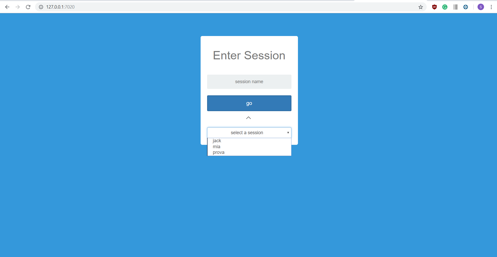
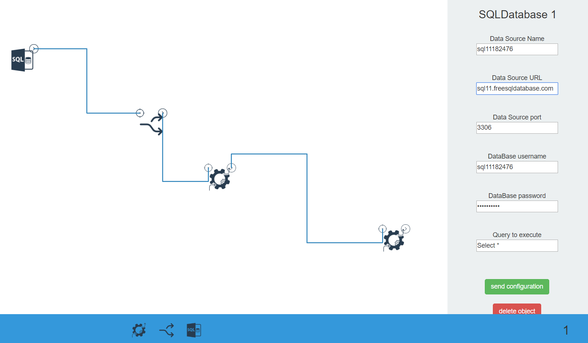
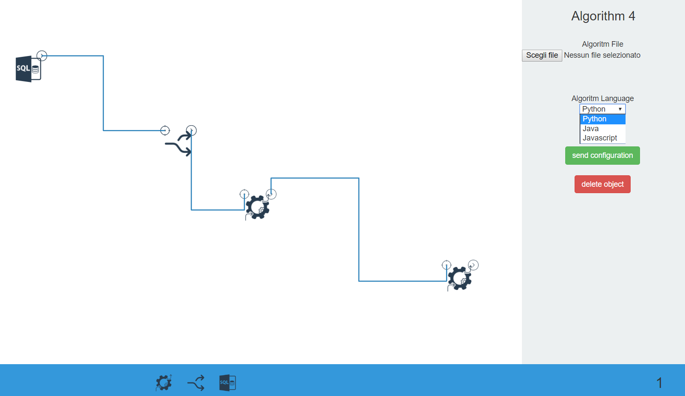

# Berlato Stefano, Bachelor Thesis #

### Bachelor Thesis, Computer Science, University of Trento - DISI, 2017
#### Supervisor: Brunato Mauro
#### Student: Berlato Stefano
#### Title: Development of a Web-based Interface for the Orchestration of Machine Learning Components

This thesis wells from the plenty of resources that the Machine Learning environment has reached nowadays, and the difficulty of integrating them efficiently by using different means. In fact, most of them are available online but, even though they are accessible and reachable very easily, the user has to navigate through all these platforms and manually handle the interaction between them to achieve his purposes. 
> I.e. download databases and query the data, implement algorithms and run them via the shell, use external tools to plot the results, et cetera.  <b>
The aim is to develop a web based, multiple-client server interface for giving the possibility to make these elements interoperate with each other in a quick and simple way. 
The idea is to have several work sessions where more clients can operate together synchronously, instantiating Machine Learning related modules such as databases, algorithms, neural networks and so on. Then these elements can be opportunely configured and connected together so to give them a semantic meaning. 
> I.e. link a database to an algorithm makes the latter analyze the data provided by the first.  <b>
Every change made by a user is reflected on the others, from a simple movement of an object to the utter deletion of another one; besides, it’s also saved on the file system of the server. The purpose is to build the foundations for such system, in order to provide all the needed basic instruments. These will be subsequently enriched with modules, some of them mentioned before, that should just take care of their own functionalities exploiting the system ones.

#### Screenshots

To run the code type `nodejs server.js`

Read the thesis in the tesiConCopertina.pdf file

Please notice that this is an incomplete project, since the thesis verged on the creation of the interface rather than the actual implementation of the components (to be done by other students) 
